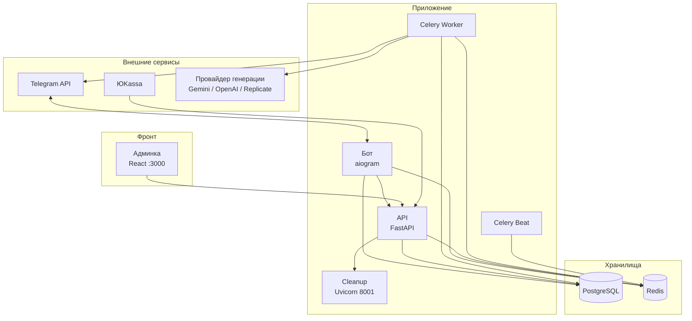

# Архитектура системы

Высокоуровневая схема компонентов и связей. Детали потоков — в [USER_FLOW_TREE.md](USER_FLOW_TREE.md).

## Компоненты

## Роли компонентов

| Компонент | Назначение |
|-----------|------------|
| **Бот** | Обработка сообщений и callback'ов Telegram, FSM (состояния в Redis), вызов API за трендами/настройками, постановка задач в Celery (генерация, доставка HD, unlock). |
| **API** | REST: health/ready, тренды, авторизация админки, раздача статики админки. Приём webhook'ов ЮKassa (оплата unlock и пакетов). Метрики Prometheus на `/metrics`. |
| **Worker** | Очереди `celery` и `generation`: генерация изображений (generate_take, generate_image), доставка HD (deliver_hd), доставка файла после оплаты unlock (deliver_unlock_file), merge фото, рассылки, отправка сообщений пользователю. |
| **Beat** | Периодические задачи: реферальные бонусы, watchdog рендеринга, детекция дропов коллекций. |
| **Cleanup** | Отдельный HTTP-сервис для админских операций очистки (зависит от API по конфигу). |
| **Админка** | SPA на React: дашборд, пользователи, тренды, платежи, настройки, безопасность, рассылки. Авторизация через API (cookie/JWT). |
| **PostgreSQL** | Основная БД: пользователи, сессии, Take/Job, платежи, заказы unlock/pack, тренды, настройки. |
| **Redis** | Брокер и бэкенд Celery, FSM бота (aiogram RedisStorage), кэш, идемпотентность. |

## Внешние интеграции

- **Telegram**: бот получает обновления, отправляет сообщения и файлы; оплата Stars через sendInvoice (провайдер — ЮKassa).
- **ЮKassa**: создание платежей по ссылке (unlock одного фото, покупка пакета). Webhook `POST /webhooks/yookassa` при `payment.succeeded` / `payment.canceled` — обновление статуса заказа и постановка задачи доставки или активации пакета.
- **Провайдер генерации** (Gemini, OpenAI, Replicate и др.): воркер запрашивает генерацию изображений по промптам и загруженным фото; конфиг через `IMAGE_PROVIDER` и соответствующие ключи в `.env`.

## Потоки данных (кратко)

1. **Генерация фото**: пользователь в боте → фото и выбор тренда → бот создаёт Take или Job → воркер генерирует через провайдер → результат отправляется в чат (превью/watermark или разблокировка по оплате).
2. **Оплата пакета (Stars/ЮMoney/банк)**: магазин в боте → pre_checkout / successful_payment или ссылка ЮKassa → API/webhook → создание/обновление Session, списание лимитов.
3. **Unlock одного фото (ЮKassa)**: выбор варианта в боте → создание UnlockOrder, ссылка на оплату → пользователь платит → webhook ЮKassa → mark_paid → задача deliver_unlock_file → отправка файла в Telegram.

Детали по каждому сценарию — в [USER_FLOW_TREE.md](USER_FLOW_TREE.md) и [PAYMENTS_OVERVIEW.md](PAYMENTS_OVERVIEW.md).

## Аудит и телеметрия

- **Аудит (audit_logs)** — единая точка сбора всех событий: каждый клик, каждый шаг воронки, действия админа и воркеров пишутся в одну таблицу. Бот, API, воркеры пишут через `AuditService.log` или `ProductAnalyticsService.track` (который записывает в audit_logs).
- **Телеметрия** — единая точка метрик: воронка, кнопки, конверсии, revenue строятся из audit_logs (эндпоинты `/admin/telemetry/*` читают только из audit_logs). Отдельного хранилища событий для метрик нет. Каталог событий — [TELEMETRY_EVENT_CATALOG.md](TELEMETRY_EVENT_CATALOG.md).
